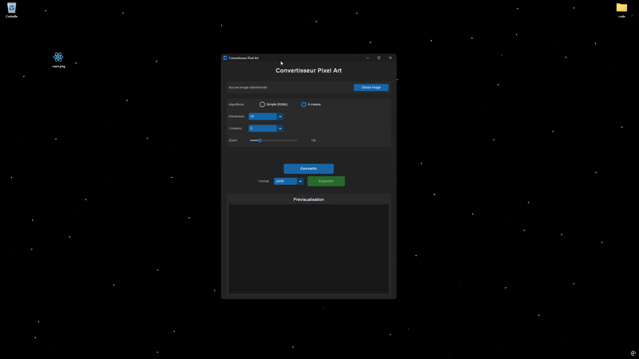

# 🎨 Convertisseur Pixel Art

> Transformez vos images en pixel art rétro

<div align="center">
  
</div>

---

## 📥 Installation

**[⬇️ Télécharger la dernière version](https://github.com/ELM-CIEL/convertisseur-pixel-art/releases/latest)**

### 🪟 Windows

Téléchargez `PixelArtConverter.exe` et double-cliquez dessus.

### 🍎 macOS

Téléchargez `PixelArtConverter-macOS`, puis dans le Terminal :

```bash
chmod +x PixelArtConverter-macOS
xattr -cr PixelArtConverter-macOS
./PixelArtConverter-macOS
```

### 🐧 Linux

Téléchargez `PixelArtConverter-Linux`, puis :

```bash
chmod +x PixelArtConverter-Linux
./PixelArtConverter-Linux
```

---

## ✨ Fonctionnalités

- 2 algorithmes de conversion (K-means, RGBA)
- Preview interactive avec zoom et pan
- Export JSON, JS, PNG (upscale 5x-50x)
- Raccourcis clavier (Ctrl+O, Ctrl+S, Ctrl+Q)

---

## ❓ Problèmes courants

<details>
<summary>🪟 <strong>Windows</strong> : "Windows a protégé votre PC"</summary>

### Solution

1. Cliquez sur **"Informations complémentaires"**
2. Puis sur **"Exécuter quand même"**

### Pourquoi ?

L'application n'est pas signée avec un certificat Microsoft (coût : ~400€/an).  
Le code source est 100% open source et vérifié par GitHub Actions.

</details>

<details>
<summary>🍎 <strong>macOS</strong> : "Impossible d'ouvrir car provenance inconnue"</summary>

### Solution 1 (Terminal - recommandé)

```bash
chmod +x PixelArtConverter-macOS
xattr -cr PixelArtConverter-macOS
./PixelArtConverter-macOS
```

### Solution 2 (Interface)

1. **Clic droit** sur le fichier → **"Ouvrir"**
2. macOS bloque → **Re-clic droit** → **"Ouvrir"**
3. Cliquer sur **"Ouvrir"** dans la popup

### Solution 3 (Préférences)

1. **Système** → **Confidentialité et sécurité**
2. Cherchez "L'ouverture a été bloquée"
3. Cliquez sur **"Ouvrir quand même"**

### Pourquoi ?

L'app n'est pas signée par Apple (coût : 99$/an + processus complexe).

</details>

<details>
<summary>🐧 <strong>Linux</strong> : Permission refusée</summary>

### Solution

```bash
chmod +x PixelArtConverter-Linux
./PixelArtConverter-Linux
```

### Si ça ne marche toujours pas

Vérifiez que vous avez les dépendances graphiques :

```bash
# Ubuntu/Debian
sudo apt install libgtk-3-0

# Fedora
sudo dnf install gtk3
```

</details>

<details>
<summary>💻 <strong>Tous</strong> : Lancer depuis le code source</summary>

### Prérequis

- Python 3.11+
- pip

### Installation

```bash
git clone https://github.com/ELM-CIEL/convertisseur-pixel-art.git
cd convertisseur-pixel-art
pip install -r requirements.txt
python app.py
```

</details>

---

## ❗ Utilisation

1. **Ouvrir une image** : Ctrl+O ou bouton "Choisir image"
2. **Configurer** : Algorithme, dimension, nombre de couleurs
3. **Convertir** : Cliquez sur "Convertir"
4. **Exporter** : Ctrl+S ou bouton "Exporter"

### Raccourcis clavier

- `Ctrl + O` : Ouvrir une image
- `Ctrl + S` : Exporter
- `Ctrl + Q` : Quitter

---

## 🛠️ Technologies

- [Python](https://www.python.org/downloads/)
- [CustomTkinter](https://github.com/TomSchimansky/CustomTkinter) - Interface moderne
- [Pillow](https://python-pillow.org/) - Traitement d'images
- [NumPy](https://numpy.org/) - Calculs matriciels

---

## 🐛 Signaler un bug

[📝 Créer une issue](https://github.com/ELM-CIEL/convertisseur-pixel-art/issues/new)

---

## 📝 Licence

MIT License - voir [LICENSE](LICENSE)

---

<div align="center">

**Développé avec <3 par [@ELM-CIEL](https://github.com/ELM-CIEL)**

[](https://github.com/ELM-CIEL/convertisseur-pixel-art/actions)
[](https://github.com/ELM-CIEL/convertisseur-pixel-art/releases)
[](LICENSE)

</div>
